# E-commerce System

## Description
This is a simple e-commerce system that allows users to manage their shopping cart. It includes features for adding products, viewing products, and checking out.

## Features
- Add products to the cart
- Remove products from the cart
- Update product quantities in the cart
- View products in the cart
- Checkout process
- Shipping products

## Architecture
The system is designed with a modular architecture, allowing for easy expansion and maintenance. The main components include:
```aiignore
src/
├── entity/
│   ├── Cart.java
│   ├── Customer.java
│   └── product/
│       ├── Expirable.java
│       ├── ExpirableProduct.java
│       ├── ExpirableShippableProduct.java
│       ├── Product.java
│       ├── Shippable.java
│       └── ShippableProduct.java
├── exception/
│   ├── EmptyCartException.java
│   ├── ExpiredProductException.java
│   ├── InsufficientBalanceException.java
│   └── InsufficientQuantityException.java
├── Main.java
└── service/
    ├── CheckoutService.java
    └── ShippingService.java
```

## Testing
The Main class includes a main method that runs the application. You can test the functionality by running this class.

### Test Functions

- 'createCustomerTest()': Tests the creation of a customer.

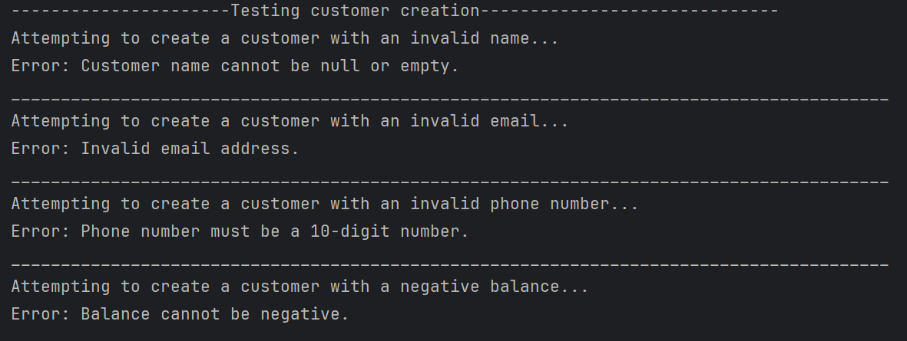

- 'createProductTest()': Tests the creation of a product.

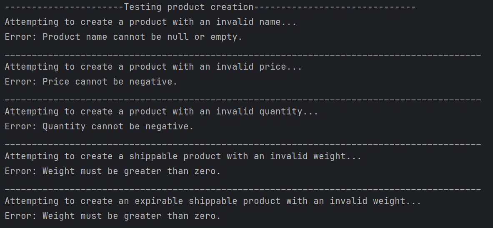

- 'addToCartTest()': Tests adding a product to the cart.

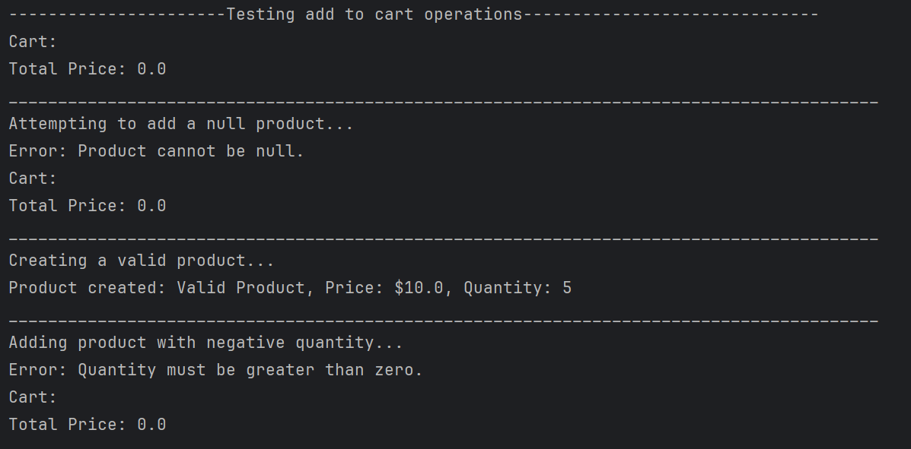
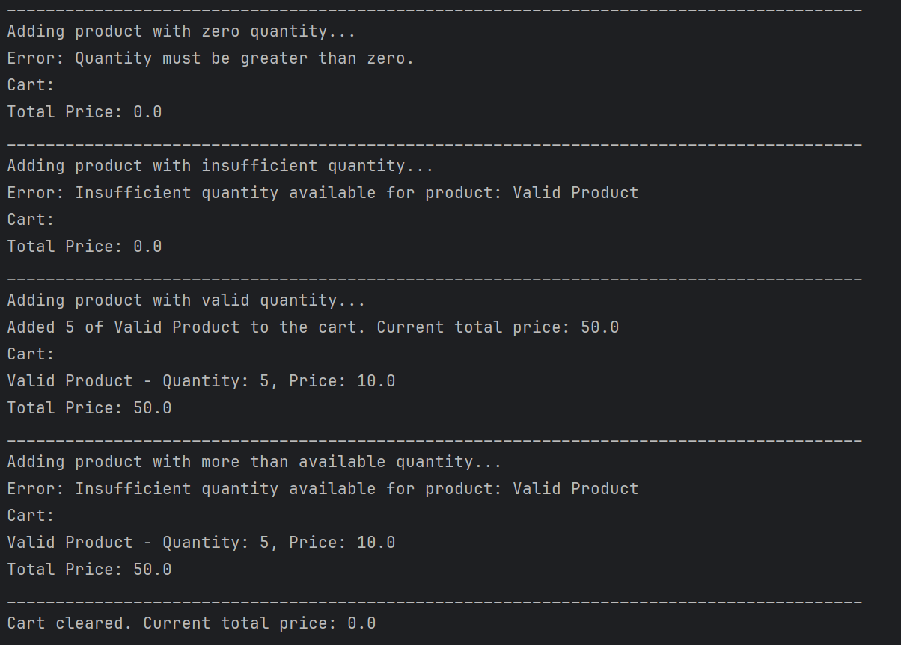

- 'removeFromCartTest()': Tests removing a product from the cart.

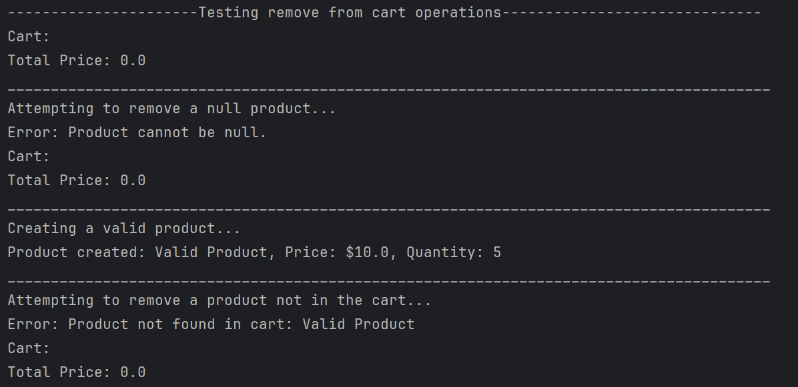
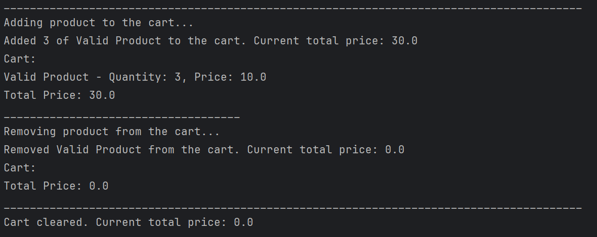

- 'updateCartTest()': Tests updating the quantity of a product in the cart.

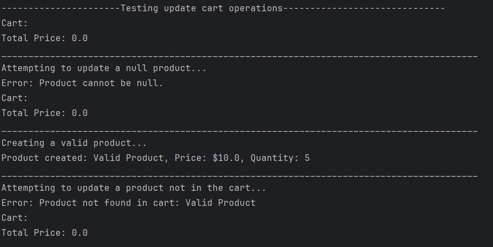
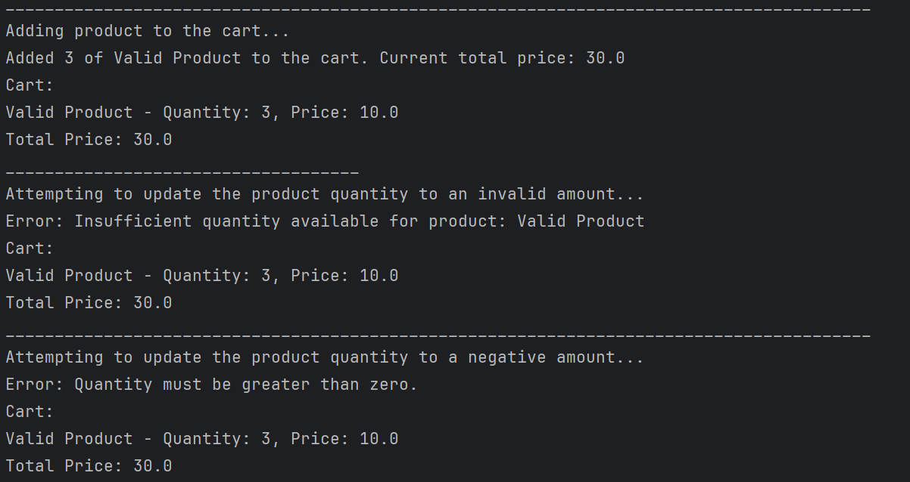
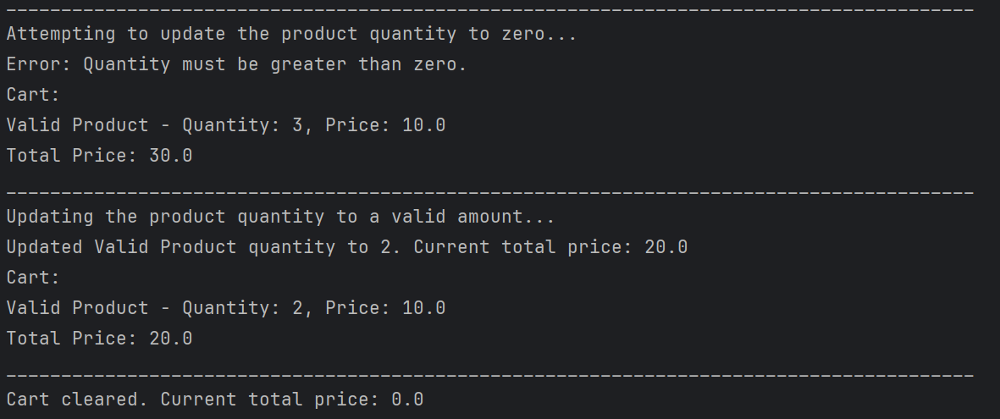

- 'checkoutTest()': Tests the checkout process.

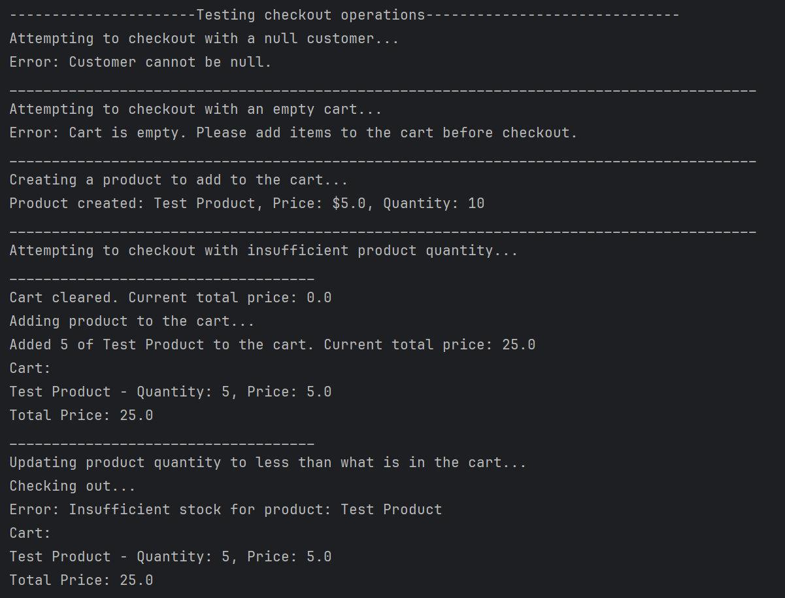
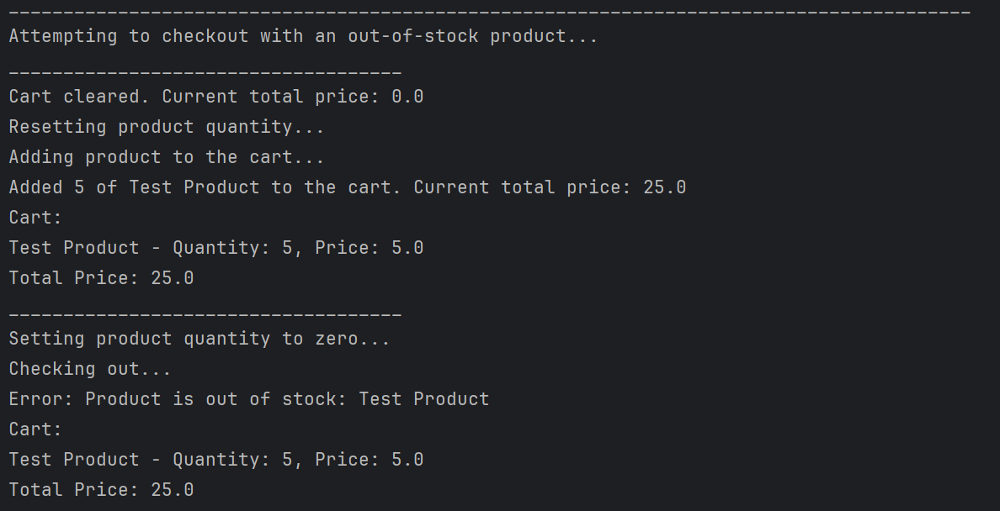

- 'successfulCheckoutTest()': Tests a successful checkout with sufficient balance.

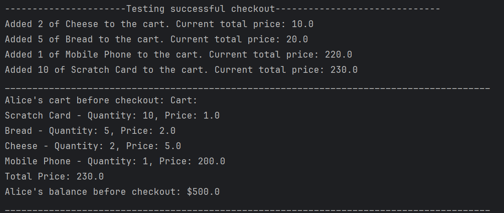
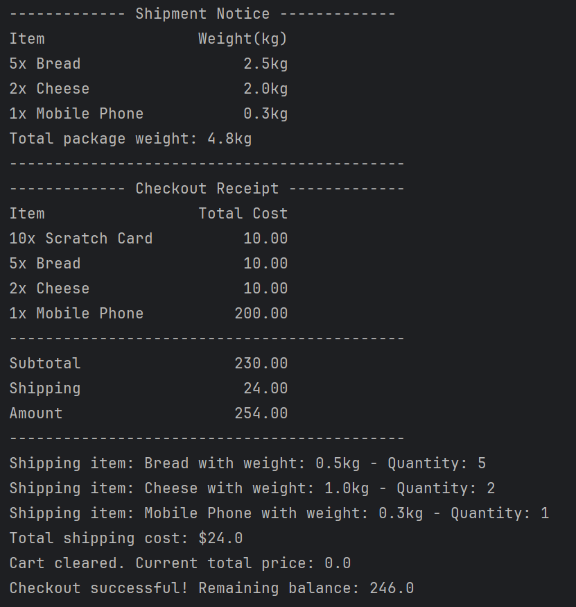
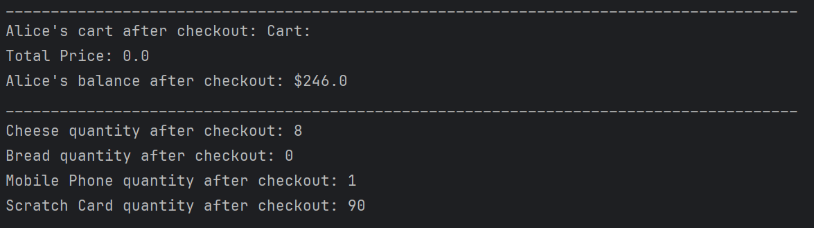